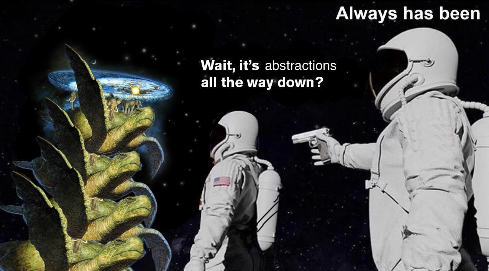

+++
date = '2024-10-30T20:02:17-05:00'
draft = false
title = 'About'
summary = "About Me"
author = "Jacob Cohen"
+++

I am a Computer Science Ph.D. student working in [bitslab](https://bits.lab.uic.edu/) with [Dr. Eriksson](https://www.cs.uic.edu/~jakob/home/index.html) at the University of Illinois in Chicago.
I'm specializing in computer *systems* because, for as long as I can remember, I've always wanted to know the <u>full picture</u>.

Of course, computers -- and almost everything, for that matter -- are abstractions on abstractions all the way down.

That said, I was never satisfied knowing I'd left something black-boxed. That's why I [implemented RSA](/projects/rsa) and why, before I'd yet taken a single abstract algebra course, I brute-forced myself a [hashing algorithm](https://github.com/CJacob314/My-First-Hash).
